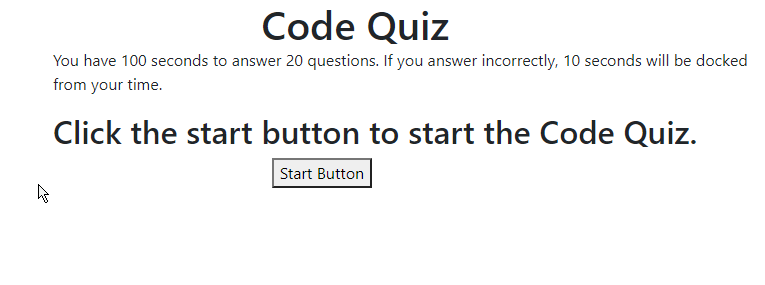

# codequiz
I built a code quiz for fun, but more importantly so I can test my knowledge of Javascript.

## This project was incredibly challanging at the start; however, after I got the first functions rolling it got easier and easier. The hardest part for me was learning how to save the score.

### HTML
	I purposly made the HTML styling bland, and simple, but effective and easy to read. I feel like I have good handle on how to make a interactive webpage with bootstrap.

### main.js
	The Javascript on this page had me spending many hours researching every detail and trial and error. It was very frustrating for me; however, through all the struggle I prevailed. By the end of the project I was adding functionality to the webpage via Javascript quite easily. I was having a blast with it!

https://greezon.github.io/codequiz/

## Contributing
Pull requests are welcome. I will not be reviewing any changes from any unknown source.

## License
[MIT](https://choosealicense.com/licenses/mit/)